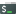
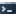
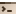
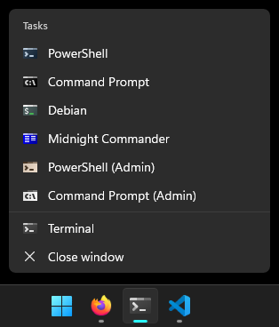

# Windows Terminal Icons

PNG Icons for use with [Windows Terminal](https://github.com/microsoft/terminal).

-  Bash/Linux/Etc.
-  Command Prompt
-  Command Prompt Admin
-  File Manager, like [FAR](https://farmanager.com/), [Midnight Commander](https://midnight-commander.org/), etc.
-  PowerShell
-  PowerShell Admin

Right-clicking on Windows Terminal icon in Windows Taskbar, or pressing `˅` in the title bar of the app, would show a drop-down menu, something like this:

Made in [Inkscape](https://inkscape.org/), with help from [Oxipng](https://github.com/shssoichiro/oxipng). Feel free to use [as you wish](https://unlicense.org/)!